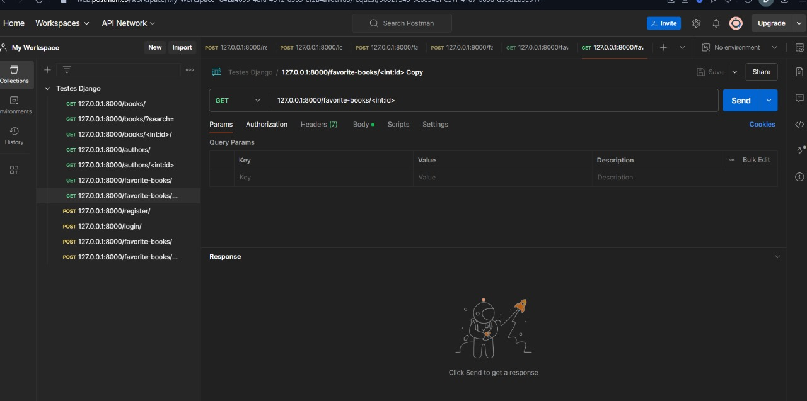

# Challenge Spotter Django Rest



### About challenge 💪

> Challenge for a company using django + django rest framework. the challenge consists of an api to
> manage books and authors, including user authentication, search functionality.

## Requirements 💻

Before you begin, make sure you've met the following requirements:

-   Need to install `Python 3+` or higher.
-   You have a `Windows, Linux or Mac` machine.
-   You need to know about `Python DJango Basics`.

## How to install 🚀

Linux & macOS

```

```

Windows

```

```
